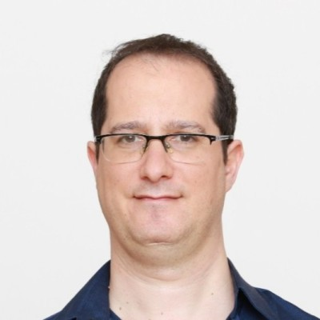

::: {.columns}
::: {.column width="40%"}

[CV](cv.html)

[GitHub](https://github.com/avnerkantor)

[Linkedin](https://www.linkedin.com/in/avnerkantor/)

avnerkantor at gmail.com

:::

::: {.column width="10%"}
:::

::: {.column width="50%"}
I am a doctoral student at [The Center for Internet Research](http://infosoc.haifa.ac.il/index.php/en/) at the University of Haifa.
My academic background is in philosophy and education while my work experience includes data science and software engineering.

My research interests are civic engagement and critical thinking in theory and practice. Over the years, my approach to these topics has evolved, from one based on philosophy to one that values data literacy, and practically from education to data science work.

As an undergraduate student, I initiated a program to train philosophy students to teach philosophy in primary schools. During this period, I organized the 13th biennial conference of the International Council of Philosophical Inquiry with Children (2007) and initiated an international workshop for philosophy students from Israel and Germany universities (2010). The workshop resulted in the publication of *Narrative, Dreams, Imagination*; within that book is my article, [“Dream and Hope”](https://books.google.co.il/books?id=MhpLAgAAQBAJ&pg=PA33) (2013).

As a graduate student, I initiated an open data platform for the OECD’s PISA research (2020). [Open PISA](http://openpisa.org/) is the first platform in the world that makes it possible for students to examine all of the research data. You can find out more by reading my article, ["Open PISA: Dashboard for Large Educational Dataset"](https://dl.acm.org/doi/abs/10.1145/3386527.3406721) (2020), in which I describe the project. Currently, I am conducting research on the impacts of transparency on public trust in data journalism.

Last but not least, I enjoy editing the Hebrew Wikipedia. I believe Wikipedia is in fact a way to change the world because the knowledge I share influences other people's knowledge. This is also how I met my wife. I was honoured to be part of a [video for Wikipedia’s 20th birthday](https://www.instagram.com/p/CKDtIM3KOOc/?igshid=1rtr7ognpqsam).

:::
:::
